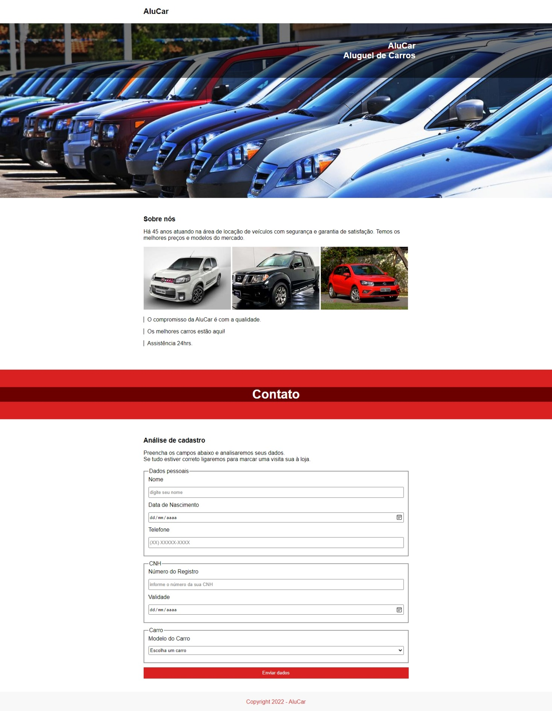

<h1>AluCar</h1>
<h3>WebPage responsiva:</h3>
<ul>
  <li>Mobile e tablets: até 547pxpx</li>
  <li>Desktop: até 1024px</li>
  <li>Desktop: acima de 1024px</li>
</ul>

<h2>Layouts Principal:</h2>

 

OBS -> Back-End, oferecido e desenvolvido pela Escola: <a href="https://www.devmedia.com.br/">DevMedia</a>, para fins educativos.

<ul>
    <caption>
        <h3>Tecnologias utilizadas:</h3>
    </caption>
    <li>Html Semântico</li>
    <li>CSS</li>
    <li>Flexbox</li>
    <li>Resposividade</li>
    <li>Formulários</li>
    <li>Editor de código: VSCode</li>
</ul>

<h3> Desenvolvido por <a href="https://www.linkedin.com/in/montemarcos/" target="_blank">Marcos Monte</a></h3>
